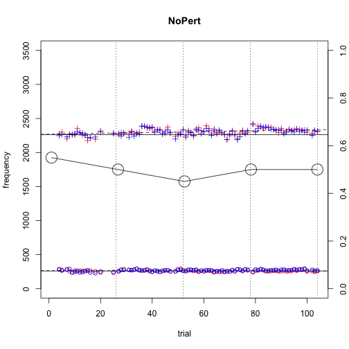
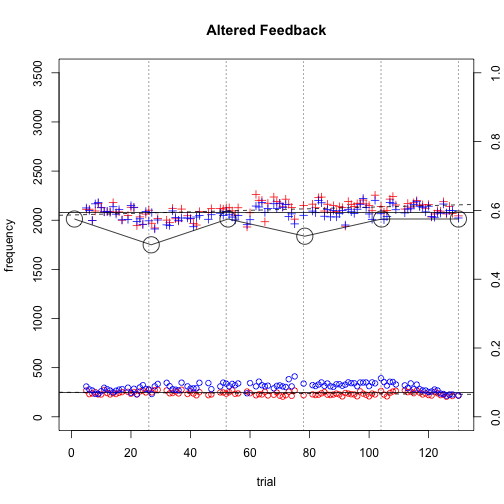
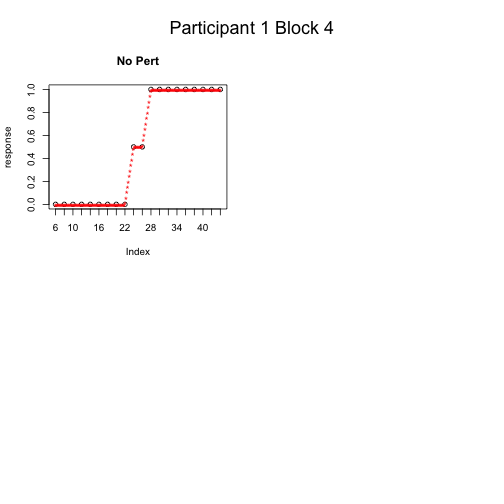

### Experiment summary:

This project is based on experiments performed in collaboration between the Max Planck Institute for Psycholinguistics and the University of California, San Francisco. All data utilized in this script have been generated by the author for the purposes of demonstration. 

### Overview of the experimental procedure.
In this experiment, the participant performed two tasks: a Production task and an Identification task. Each session began with an Identification task, followed by a Production task, followed by an Identification task, for a total of 4 Production tasks and 5 Identification tasks completed in each session. We predicted that exposure to altered auditory feedback would affect the identification of contextually-dependent speech sounds drawn from a computer generated continuuum. 

In the Production task, the participant was presented with 26 words containing the vowel /i/ and asked to read them aloud. In the first session ("NoPert"), the participant heard their unaltered voice via headphones. In the second session ("YesPert"), the resonating frequencies of the participants voice were shifted backwards in the vowel space. The shift occurred slowly to prevent the participant from noticing. The shift began on the first trial of the second block, slowly increasing until the last trial of the second block. The shift then persisted at full strength for the following two blocks.

In the Identification task, the participant was asked identify via keyboard whether they heard a speaker producing the word "see" (response button 1) or the word "she" (response button 2). The presented stimuli were drawn from a continuum between "see" and "she", generated via additive synthesis. 

### Results

The graphs below show the measurements for the first and second resonant frequencies of the voice over the course of the experiment. Red crosses represent what the participant actually produced, while blue crosses indicate the frequency of the auditory feedback transmitted over headphones (what the participant heard themselves saying). The solid line indicates the mean of the first production block, and is utilized as a baseline of comparison for all subsequent production blocks.

The large circles indicate the proportion of "she" responses obtained during the identification tasks before and after each production block. 

In the first (NoPert) session, input and output are identical throughout the experiment.

 

In the second (YesPert) session, the first frequency is shifted upwards (higher than normal) and the second frequency is shifted downwards (lower than normal). Decreasing the dispersion between these two frequencies results in a vowel that sounds more rounded and farther back in the vowelspace than the speaker intended. 

 

These graphs show that in the first session, the participant experienced a steady decrease in the number of stimuli perceived as "she." In the second session, the proportion of "she" responses remains relatively stable. 

Another method of comparing performance in the two sessions is to determine the stimulus number at which the participant switched from reporting hearing "see" to reporting hearing "she". 

The graph below contrasts performance in "Block 4" of each session. The first column shows the participant's responses to each stimulus, indicated by the black circles. Red asterisks represent linearly interpolated data points between the participant's responses. The second column shows the results of fitting a sigmoid-curve to the interpolated responses. The dotted line indicates the 50% response point, i.e. the stimulus number at which the participant stopped hearing "see" and started hearing "she".

 

These results suggest that, for this participant, there was no effect of altered auditory feedback on the interwoven identification tasks. 

