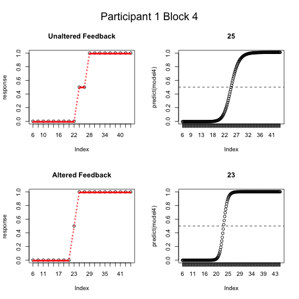

### Experiment summary:

This project is based on experiments performed in collaboration between the Max Planck Institute for Psycholinguistics and the University of California, San Francisco. All data utilized in this script have been generated by the author for the purposes of demonstration. 

Speech sounds can be perceived differently depending the following or preceding sounds. For example, an ambiguous sound somewhere between /s/ ('s' as in 'see') and /S/ ('esh' as in 'she') is more likely to be perceived as /S/ if it is followed by /i/ and as /s/ if it followed by /u/. This is because as speakers, we know that as we are producing the /s/ or /S/ our mouths are already preparing to produce a following vowel and this will affect the frequencies of the consonant that precedes the vowel, and our perceptual systems automatically compensate for these small changes in frequency. 

Producing speech involves moving different parts of our mouths, our "articulators." Our brains store information about the configuration of articulators and the resulting sounds that are produced. These 'motor-to-sound' mappings link movements of jaw, tongue and vocal cords to specific sounds. Many theories suggest that the reason why our sensory systems can compensate for how one sound can affect the frequencies of a preceding sound is because we have implicit knowledge of these motor-to-sound mappings. We can link the change in frequency to a change in the position of our articulators.

One method that has been used to investigate the relationship between producing and perceiving speech sounds is "altered auditory feedback." Altered auditory feedback involves manipulating speech sounds in real time to create a mismatch between what a speaker says and what he or she hears. For example, a speaker says the vowel /i/ ('ee'), yet by altering the frequencies of the vowel, the speaker hears his or herself producing a sound more like /u/ ('oo'). Therefore in order to produce the intended /i/ sound, the speaker must alter his or her articulations. If this shift in frequency is introduced slowly, the speaker may adapt to the change without ever becoming consciously aware of doing so. Thus, altered auditory feedback can 'rewire' the mapping between what a person articulates and the resulting sound that is heard. 

In this experiment, we investigated whether a change in the motor-to-sound mapping for a specific vowel could also affect how a preceding sound is perceived. That is, if we alter the motor-to-sound mapping for the vowel /i/, will this subsequently affect how an ambiguous consonant sound between between /s/ and /S/ is perceived? The answer to this question has implications for theories of how mappings between sounds and articulations are stored and represented in the brain. 

In order to test whether this is the case, we presented participants with ambiguous sounds and asked them to report whether they heard "see" or "she." Meanwhile, the participant was also asked to produce words containing the vowel /i/, such as "beet" and "deed." In one session, the participants heard their normal, unaltered voices, while in the other session we induced a small shift that made the /i/ vowel sound more like /u/. By comparing responses in the two sessions it is then possible to determine whether or not the altered feedback can have an effect on perception of the ambiguous consonant. 

### Overview of the experimental procedure.
In this experiment, the participant performed two tasks: a Production task and an Identification task. Each session began with an Identification task, followed by a Production task, followed by an Identification task, for a total of 4 Production tasks and 5 Identification tasks completed in each session. We predicted that exposure to altered auditory feedback would affect the identification of contextually-dependent speech sounds drawn from a computer generated continuuum. 

In the Production task, the participant was presented with 26 words containing the vowel /i/ and asked to read them aloud. In the first session, the participant heard their unaltered voice via headphones. In the second session, the resonating frequencies of the participants voice were shifted in the vowel space to sound more like /u/. The shift occurred slowly to prevent the participant from noticing. The shift began on the first trial of the second block, slowly increasing until the last trial of the second block. The shift then persisted at full strength for the following two blocks.

In the Identification task, the participant was asked identify via keyboard whether they heard a speaker producing the word "see" (response button 1) or the word "she" (response button 2). The presented stimuli were drawn from a continuum between "see" and "she", generated via additive synthesis. 

### Results

The graphs below show the measurements for the first and second resonant frequencies of the voice over the course of the experiment. Red crosses represent what the participant actually produced, while blue crosses indicate the frequency of the auditory feedback transmitted over headphones (what the participant heard themselves saying). The solid line indicates the mean of the first production block, and is utilized as a baseline of comparison for all subsequent production blocks.

The large circles indicate the proportion of "she" responses obtained during the identification tasks before and after each production block. 

In the first (unaltered feedback) session, input and output are identical throughout the experiment.

 

In the second (altered feedback) session, the first frequency is shifted upwards (higher than normal) and the second frequency is shifted downwards (lower than normal). Decreasing the dispersion between these two frequencies results in a vowel that sounds more rounded and farther back in the vowelspace than the speaker intended. 

 

These graphs show that in the first session, the participant experienced a steady decrease in the number of stimuli perceived as "she." In the second session, the proportion of "she" responses remains relatively stable. 

Another method of comparing performance in the two sessions is to determine the stimulus number at which the participant switched from reporting hearing "see" to reporting hearing "she". 

The graph below contrasts performance in "Block 4" of each session. The first column shows the participant's responses to each stimulus, indicated by the black circles. Red asterisks represent linearly interpolated data points between the participant's responses. The second column shows the results of fitting a sigmoid-curve to the interpolated responses. The dotted line indicates the 50% response point, i.e. the stimulus number at which the participant stopped hearing "see" and started hearing "she".

 

This suggest that there may be a very small difference in the boundary in the different sessions. However, without more participants, it is not possible to determine whether this change in the boundary is the result of normal variation or can be attributed confidently to the altered auditory feedback. 

